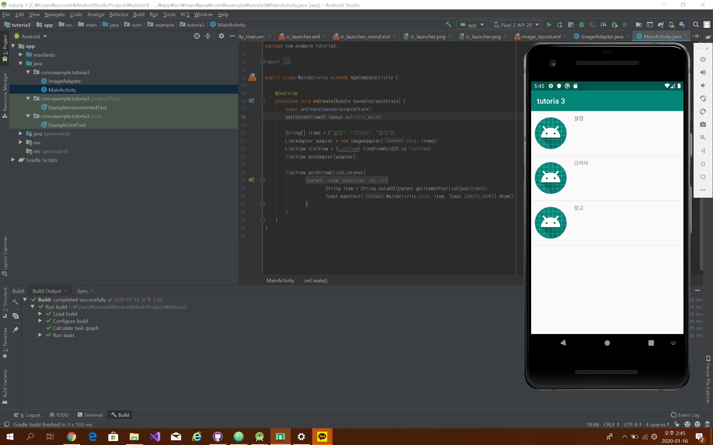
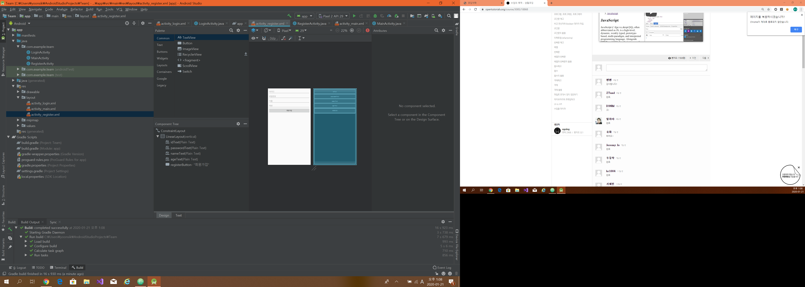

## 모각코 1일차. 2020.01.14

오늘은 첫 번째 모각코 모임을 가졌습니다.
같이 주니어 소프트웨어 대회를 참가하기 때문에 이를 만들기 위한 사전 지식을 쌓는 시간을 각자 갖기로 했습니다.
인프런 강의를 통해 공부함.

```markdown
오늘의 목표
android studio

1. 리스트 뷰
2. 액티비티 화면 전환
3. 버튼 이미지 애니메이션
4. 레이아웃
```

1. 리스트 뷰
- 안드로이드 ListView ListView는 사용자가 정의한 데이터 목록을 아이템 단위로 구성하여 화면에 출력하는 ViewGroup의 한 종류



```markdown
public class ImageAdapter extends ArrayAdapter<String> {
    ImageAdapter(Context context, String[] items) {
        super(context, R.layout.image_layout, items);
    }

    @NonNull
    @Override
    public View getView(int position, View convertView, ViewGroup parent) {
        LayoutInflater imageInflater = LayoutInflater.from(getContext());
        View view = imageInflater.inflate(R.layout.image_layout, parent, false);
        String item = getItem(position);
        TextView textView = (TextView) view.findViewById(R.id.textView);
        ImageView imageView = (ImageView) view.findViewById(R.id.imageView);
        textView.setText(item);
        imageView.setImageResource(R.mipmap.ic_launcher);
        return view;
    }
}
```
```markdown
public class MainActivity extends AppCompatActivity {

    @Override
    protected void onCreate(Bundle savedInstanceState) {
        super.onCreate(savedInstanceState);
        setContentView(R.layout.activity_main);

        String[] Items = {"설정", "으아아", "망고"};
        ListAdapter adapter = new ImageAdapter(this, Items);
        ListView listView = (ListView) findViewById(R.id.listView);
        listView.setAdapter(adapter);

        listView.setOnItemClickListener(
                new AdapterView.OnItemClickListener() {
                    @Override
                    public void onItemClick(AdapterView<?> parent, View view, int position, long id) {
                        String item = String.valueOf(parent.getItemAtPosition(position));
                        Toast.makeText(MainActivity.this, item, Toast.LENGTH_SHORT).show();
                    }
                }
        );
    }
}
```

일반적인 리스트뷰의 각각에 이미지를 추가하기 위해 ImageAdapter class를 만들어서 이미지를 넣은 리스트뷰의 레이아웃을 구성하고 이를 MainActivity class로 리스트뷰를 구성.

2. 액티비티 화면 전환
- 안드로이드 스튜디오에서 여러개의 액티비티와 그에 따른 각각의 레이아웃을 생성하고 액티비티에 의해 다른 레이아웃으로 전환하도록 작성함.

3. 버튼 이미지 애니메이션
- 특정 이미지를 통해 버튼을 생성해서 특정 조건에 따라 버튼의 이미지가 달라지게 함.

4. 레이아웃
- 흔히 알고 있는 그리드 레이아웃부터 Linear, Horizontal 레이아웃 등을 공부함.


## 모각코 2일차. 2020.01.16

짦지만 그동안 공부한 내용과 더불어 주니어 소프트웨어 대회에 제출할 앱을 대략적으로 만들어 보려고 함.
우선은 로그인 시스템과 우리가 계획한 레이아웃을 꾸미는 것이 목표.


우선은 처음 앱을 실행할 시 보게 될 로그인 화면을 설계하고 로그인 후 화면, 회원가입 화면과 각각의 화면전환 기능을 넣음.

로그인 시스템을 구현하려고 하는데 서버가 필요함을 알게 됨.
my sql과 php를 이용해서 만드는 것을 보고 이를 공부하기로 결심함.

## 모각코 3일차. 2020.01.21

비록 주니어 소프트웨어 대회 작품은 시간 관계상 포기하게 되었지만 작품은 혼자서 만들어 보려고 함.
이를 위해서 오늘은 생활코딩 사이트에서 JavaScript 공부할 계획.

JavaScript

html에서 <script></script> 사이에 들어가는 코드를 자바스크립트로 인식함.
document.write(1+1); 과 같이 스크립트 태그 안에 넣은 값에 대해 html과 다르게 끝에 세미콜론(;)을 붙여야 하고
프로그래밍 언어와 같이 반복문이나 함수 등으로 다양한 효과를 넣을 수 있음.
```markdown
<script>
  if(1===1) {   //조건문
    document.write('123<br>');
  } else {
    document.write('123123<br>');
  }

  var arr = ["egoing", "asdf"]; //배열
  arr.push('ad'); //배열 추가

  var i = 0;
  while(i<3) { //반복문

  }
</script>
```
와 같이 JavaScript의 반복문, 조건문, 배열은 다른 프로그래밍 언어와 매우 유사함.

```markdown
<input id="night_day" type="button" value="night" onclick="
    var target = document.querySelector('body');
    if(this.value === 'night'){
      target.style.backgroundColor = 'black';
      target.style.color = 'white';
      this.value = 'day';
    } else {
      target.style.backgroundColor = 'white';
      target.style.color = 'black';
      this.value = 'night';
    }
  ">
```
다음은 버튼을 누를 경우 html의 body태그를 감싸는 배경을 하얀색, 글씨를 검정색으로 바꾸는 버튼이다.
type값에 따라 버튼 뿐만 아니라 text, passward 타입 등으로 아이디나 비밀번호, 기타 등을 입력받거나 입력할 수 있는 택스트 등을 만들 수 있다.
또한 onclick과 같이 버튼을 눌렀을 경우, 텍스트에 숫자를 입력할 경우 등의 특정 조건에 따른 실행문을 작성할 수 있다.
querySelector를 통해 특정 태그를 지정하여 css의 효과를 준다.


# 모각코 4일차. 2020.01.30
Nodejs를 공부하고 mysql에 연동해서 회원가입 기능을 만드는 데에 이용할 계획이다.

# 모각코 5일차. 2020.02.04

# 모각코 6일차. 2020.02.06
